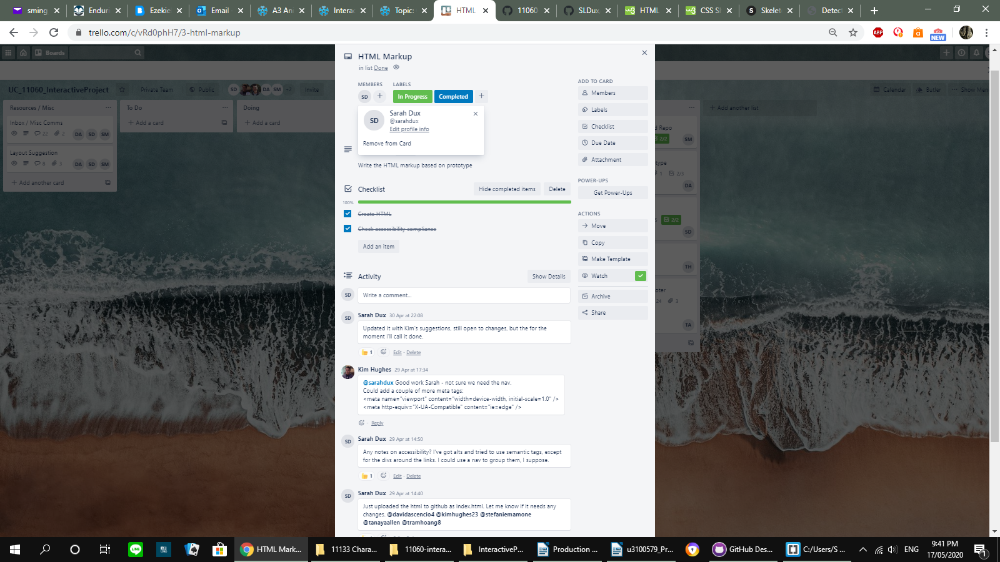

# U3100579_InteractiveProject_11060

[Project Link](https://sldux.github.io/U3100579_InteractiveProject_11060/)

# Production Journal

## Group Project 
Production of the group project began with discussions during online tutorials and a group chat page was arranged. Early discussions about the SCRUM roles and the product backlog were discussed. There was some issues in getting everyone set up at first, as we didn’t have everybody’s contact details. The first steps were defining roles, deciding which platform to use for the project, (Github was the choice) and getting everybody’s contact details etc. 

Kimberbley set up the Trello board and took on the role of SCRUM master, organising the rest of the group and various scrum deadlines. A product owner was never officially declared, and no one person really possessed a vision for the product which was conveyed to the team. 

The roles for the 6 people in the group were outlined as 
- Trello setup / SCRUM master
- Design / Prototype page
- Set up Github pages and write README.md
- HTML markup
- CSS Styling
- Collate and add content

Group members were invited to say which role was their favourite, and groups were assigned, and each given a deadline through the Trello board. 

Trello board

We adopted a fairly relaxed Scrum method of the 6 of us, deadlines were set for each task, but they were flexible. From this point most of our communication was done through Trello. Work progressed smoothly during the remainder of the project. We shared the role of quality testing and several times issues were spotted or adjustments made. Several members put forth suggestions for the project title and people were asked to vote for their favourites, though not everybody did. The final title was chosen from a shortlist of favourites by the tutor. Some minor communication issues did continue, with people not responding to messages for several days, but no real issues came from it. 

I chose the role of creating the HTML, and this was major contribution to the project. I did this based on the layouts and mock up that David that designed. I particularly tried to use more semantic tags where appropriate as was outlined on the Trello task. I made several changes to it after feedback from group members, and also a last minute change on Sunday night when I realised I written the required text in the footer slightly wrong, which I changed. 

Roles 

HTML role on Trello assigned to me

Last minute change

Original HTML commits

The HTML I created 

## Individual Project 

### Original Project Proposal

Orginally I had a project proposal (mostly) writen for the previous version of this project. I decided that it wasn't 'GLAM' enough/was too complicated, so I brainstormed again, though they are similar. Included it here in case you wanted to see it.

Screenshot of project proposal

### Defining a problem

To define a problem for this project I begun researching Atlas of Living Australia and other related API’s and decided to focus my application around displaying information on the plant and animal species in the users area, based on their location. 

Problem version 1:
“I want to learn more about the plants and animals in my area.” 

Originally I had wanted to present the information in a series of puzzles. But decided that the puzzle format gets in the way of the primary purpose of displaying the information, so decided to create a more goal-based approach. 
I redefined my initial problem after considering the context. Why would someone want to learn about the animals and plants in their area?

Problem version 2: 
“I want to learn about, and identify plants and animals in my area, so I can find out which ones might be dangerous.”

After more research into the Trefle and ALA API’s, I further refined my idea due to data limitations, limiting it to plants only. I also considered that most people know more about the dangerous animals in this country, whereas comparatively few people might know about the dangerous nature of some plants, and how to identify them. 

Problem version 3:
“I want to learn about and identify plants in my area, so I can find out which ones might be dangerous.”

### API Research 

I conducted early research into the GLAM and public API’s, and the types of data they produced. This lead me to identify Trefle and The Atlas of Living Australia as primary data sources for this project. I also looked at other API’s but decided that many of those would not be of use to me for this project. Other API that I researched included: Trove, Biodiversity Library, Australian Data Archive, and Data.gov.au among others.

I conducted more detailed research into the data available through my chosen API’s. 

#### ALA
The Atlas of Living Australia API contains information about plants and animals in Australia, in the form of occurrence data and species profiles, but gathers this data from a wide variety of other sources, and is the most complete source of data of this kind. Though the instructions are not particularly comprehensive, occurrence data is easy to access, however the data for the species profiles, was not as complete through the API as through the website portal. I discovered that the animal species profiles contained information about if the animal was dangerous (that intended to use for my project), however this information only seemed accessible through the website, and not the API, further more, this information was not available for all animals. With this limitation in mind, and unable to find any other reliable source of this data through other API’s (GBIF, data.gov.au, Idigbio, ITIS, and various museums) I restricted my design problem to plants specifically. Planning to use the occurrence data for plants from ALA and then use these results to get the detailed plant information, including plant toxicity, from the trefle API. 

#### Trefle
Trefle is limited specifically to plants, and is not Australia specific, but provides much technical information about plants and their properties and growing habits. I was specifically interested in the images and descriptions of plants and toxicity information.  I discovered however that much of Trefle’s data is not complete and during production, many of my initial results returned ‘null’ data. So to circumvent this problem I restricted the program to display only the information from Trefle that was complete to ensure I had data to display.

### Examples

#### Apps for identifying plants
Most of these apps use images for identifying plants, and provide similar types of data.

- Taxonomy (scientific classifications) /family of plant 
- Images
- Common/scientific names
- Descriptions (paragraph or technical)
- Growing range or conditions
- Technical info about plant and growing conditions. (less common)

[Plant Snap](https://www.plantsnap.com/)

[Garden Answers App](http://www.gardenanswers.com/)

User takes a photo of the plant, and it returns data. Easy to use. Possibly returns limited information.

[Go Botany](https://gobotany.nativeplanttrust.org/species/conium/maculatum/)

Helps you identify plants by asking you to compare your plant to a series of plant groups.
Returns more detailed and technical plant description information, however limited to New England. Is fairly complicated and requires good prior plant knowledge to use.

[Weeds.org.au](https://weeds.org.au/weeds-profiles/?category=grass&region=nsw)

A database of Australian weeds. Can filter by type or name of weed or state. 
Provides a gallery of results, and specific weed profiles. Provides detailed information about many properties, including descriptions, taxon information, growing conditions and distributions, history, and others.

[What’s that flower?](https://whatsthatflower.com/)

Flower specific, provides fairly detailed images and information. Can search by a variety of methods, including characteristics or photos. Primarily taxon information, descriptions and properties and occasionally toxicity.

[iGarten (and related apps)](http://www.ipflanzen.ch/pages/en/home.php?lang=EN )

Plant encyclopedia apps, provides very comprehensive information about a variety of plants, information is heavily technical. Contains information on botanical traits, habitats, history and medicinal uses and properties.

[ABC plant finder](https://www.abc.net.au/gardening/plant-finder/)

A database of plants that provides information on traits, descriptions, cultivation, flowering and images. Based around gardening rather than identification of dangerous plants like many of these, but I appreciated the simple layout, and the grid layout. Not too technical, but provides good information for its purpose. 
The grid based, straight forward layout featuring prominent images was used as inspiration for the css styling of my own application. 

#### Apps relating to plant toxicity
Other applications relating specifically to identifying toxic and poisonous plants were less common, and often contained less information, and even fewer images than other plant apps. 
Most apps contained only names, and images, and a brief descriptive line about the plant.

[Poison.org](https://www.poison.org/articles/plant )

Contains a list of poisonous plants with images and scientific and common names in a table.

[SGA](https://www.sgaonline.org.au/getting-to-know-poisonous-plants/)

Contains lists of poisonous plants, scientific and common names and brief descriptive info, but limited pictures.

#### Apps for displaying plant occurrences in an area
Again there are less applications specifically for identifying the plants that are in your area. The ALA is a good examples of these, but there are other examples. Most of these apps that fetch occurrence data, display limited information about the species in question. Many are not plant specific. Displaying occurrence data on an interactive map or static distribution map is common. 

[Map of Life](https://mol.org/species/Ilex_opaca) and [for mobile](https://mol.org/mobile#/0/4)

Shows the occurrence data and distribution area of plant and animal species around the world. But contains limited information about species specifically. 

[GroNATIVE](https://www.bushcare.com.au/gronative-app/)

This app is plant specific. Uses your postcode to search for native plants that occur in your area, then helps you choose native pants to put in your garden based on what grows around you. Displays some information about descriptions, and growing conditions. But information still limited compared to other plant apps.

### Designing the application

#### Content

Based on my design problem, I need to address these goals. 
- Display the plants that have been recorded in users area, based on location. 
- Provide information to be able to identify these plants where available, images, descriptions, growing conditions (Are they shade loving plants or are you likely to find them in a hot position?) etc. 
- Provide information about the plant’s toxicity. 

Based on these, the data available and the conventions identified in examples, the information I will be displaying about the individual plants is: 
- Images
- Names (scientific and common)
- Descriptive information. 
- Toxicity
- Growing conditions 

From this information I drew up several sketches for the design, that evolved as I altered my ideas to suit a more simple design and a more restricted time frame. There were several additions I considered but did not include:
- Displaying some kind of map of the location gotten from the browser, or a map showing the occurrences e.g. From ALA. As was common in other search by occurrence apps. 
- Adding the options of searching by user input location or searching by state or region, instead of just browser location. 

#### Design

Early ideas featuring maps, and options for user inputed locations.
 

 

Closer to my end design, featuring individual pages or modals for more details. Also experimented with including a puzzle page, based on a previous idea.

Quick sketch of my final proposed design.

For the design of the application, I used the simplicity and functionality of apps like Plantsnap, Weeds.org, ABC plant finder and GroNATIVE as inspiration. Keeping the design simple, readable and in a neat grid type layout. Images featured heavily in my design, as per convention for most plant identification apps, this also provides an easy way to identify the pants. However as I had no choice over what images would be featured, I decided to keep the rest of the design neat, readable, making use of images and monotone colours to avoid looking too cluttered. 

In order to keep the main page neat and simply designed I intended to display only the basic information on the main page. The names, and image and toxicity information. And display the rest of the information in a light box type modal that opened when the image was clicked. However this did present me with some issues in production. And I was forced to abandon this, and include all the info on the main page, as I could not get it working in time.

I also added the coloured smiley faces to the toxicity display, as a way of adding a little bit of novelty to the design, but in a way that was helpful to the product goals. By including an easily recognised visual symbol with a standard type of colour coding often used for warnings, I was able to make the primary information, the toxicity, easily visible to users, adding a touch of novelty and increasing usability. 

### Developing Process and Issues 

I created the function that collects occurrence data from the ALA, by using the location information recorded in the browser, and using the Geolocation API to return the name of the location. 
I then created separate a function that takes the ALA plant ids from all the occurrence results and retrieves more detailed information. I later changed this as I realised I didn’t need to collect the detailed information from the ALA API and used the name from the occurrence data to retrieve the detailed information from the Trefle API. Limiting the results to display only the data from Trefle that was complete, as I was receiving a lot of ‘null’ results from the occurrence data. This also helped to limit the information being displayed on the page. I also restricted the ALA API to retrieve only the first 100 occurrences for the location, which it checks for data with Trefle, this was mostly to make the loading times more manageable, and to restrict the plants being displayed on the main page. The last set of functions to create were to display the data retrieved from the API’s onto the page.

I ran into several problems on the way, mostly minor syntax errors, or CORS errors. But I also had issues with 500 errors and the API servers.

I emailed my tutor for assistance with displaying the information in the html, as I was having some issues with getting that to display correctly. 

He adjusted my code, putting the information I had retrieved from the APIs in some arrays for easier access, and fixed my data issues, as well as my CORS errors, and in general just made everything better. He also added a setTime delay to some of the functions, which prevented the functions from trying to display the data that had not yet been retrieved causing my ‘undefined’ errors. I adjusted this several times afterwards to cater for my super slow internet speed that I was having issues with as well. At one point I had a 2 minute delay on one function just to give my internet time to load all the data before it tried to display it. Possibly not the neatest solution, but it worked. 

I continued to have some issues with slow internet and loading speeds and the API servers occasionally not being available, thought these were frustrating, I did not know how to fix them with the time I had remaining.

Once I had gotten the basic information displayed on the front page, I created a function to display the detailed information in a modal type light box that would appear on the page when the image of a plant was clicked, I had some issues with getting the function to retrieve the correct id for each plant image and then using that to create a dynamic selector for the Jquery to make the correct Modal box visible on the page. But had to abandon that due to restricted time, and ending up simply displaying all the information on one page/managed to get the modal to work. 

Speficially I was having issues with the jQuery selector selecting only the DIV that I clicked on, by Id, as the id was based on a variable that I did not know before hand. But eventualy I got that to work, but in the end my .css(display: block) and .show() and the other things I tried wouldn't work, even when it had the right id. I did not have enough time to figure it out before submission. 

The other challenges with this project, apart from the slow internet and unavailable servers, were mostly due to time restrictions. There were additions I would have liked to include but didn’t have the time to implement. I was also restricted in my time to complete the css due to other projects, so that is not as polished as I would like. Overall I am reasonably pleased with this project, however am slightly frustrated that it functions poorly sometimes due to server issues and internet speeds. I also see much room for improvement.
